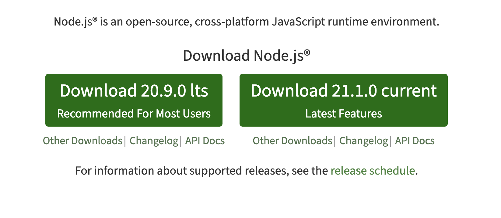
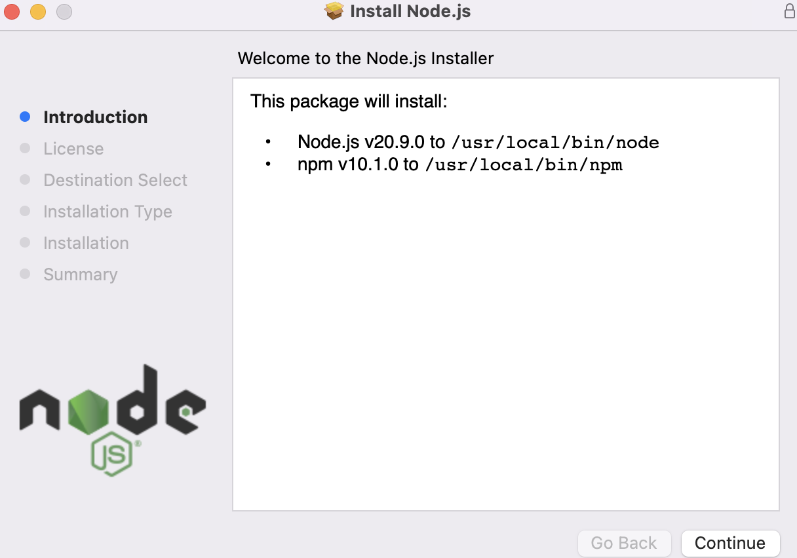
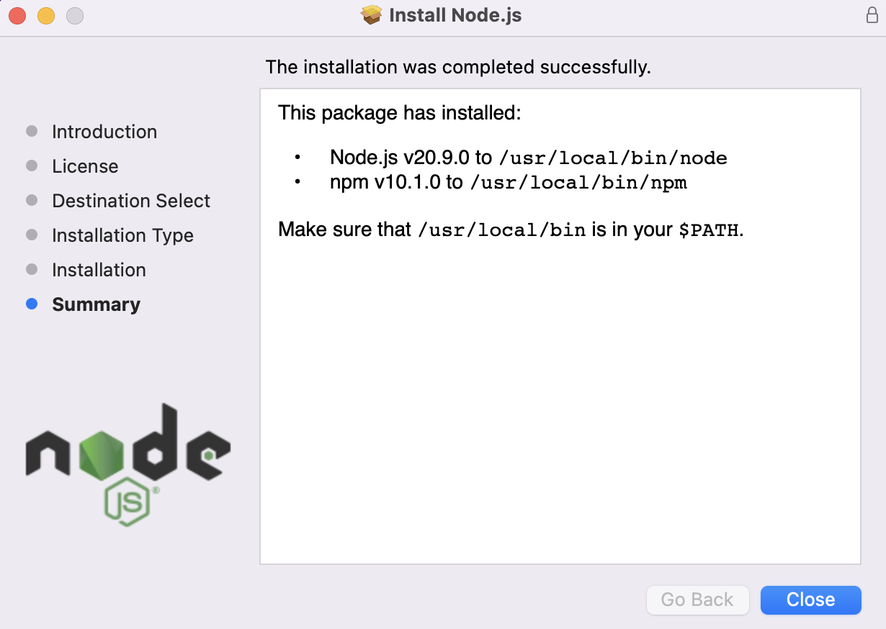

## 1. Installing NodeJs
1. Go to NodeJs Website : https://nodejs.org/en
2. Download latest NodeJs package and install it.
3. Image Guide (3 Steps):  

4. Video Guide :  
Mac : https://www.youtube.com/watch?v=pHz7TgEIa0w  
Windows : https://www.youtube.com/watch?v=X-FPCwZFU_8

## 2. Running the Project
1. Clone the repository:
`git clone https://github.com/anantdahiya8/receipt-processor.git`, then `cd receipt-processor`
2. Install dependencies:
`npm install`
3. Start the dev server:
`npm start`
4. Server will start on port 4000.  (Urls: POST: http://localhost:4000/receipts/process, GET: http://localhost:4000/receipts/{id}/points)

## 3. Running using Docker
1. Clone the repository:
`git clone https://github.com/anantdahiya8/receipt-processor.git`, then `cd receipt-processor`
2. Build Image:
`docker build -t rp:1 .`
3. Run the image:
`docker run -d -p 4000:4000 rp:1`
4. Server will start on port 4000.  (Urls: POST: http://localhost:4000/receipts/process, GET: http://localhost:4000/receipts/{id}/points)

## 4. Running the Tests
1. Run the test:
`npm run test`

## 4. Demo Video
https://github.com/anantdahiya8/receipt-processor/assets/20678029/0c5467ca-4505-4258-97ef-e0679766a8f5

